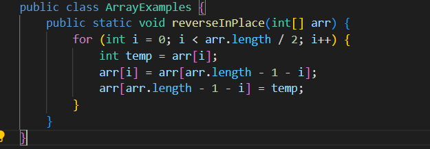
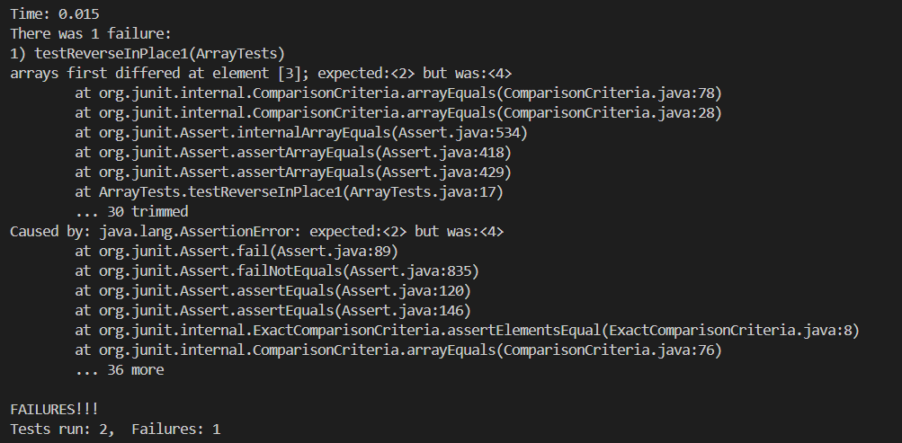
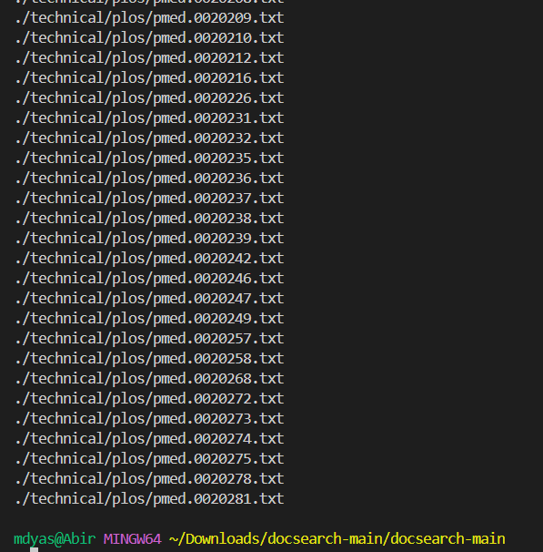

Part 1 - Bugs

A failure-inducing input for the buggy program, as a JUnit test and any associated code (write it as a code block in Markdown).

Associated code

2. An input that doesn't induce a failure, as a JUnit test and any associated code (write it as a code block in Markdown).

3. The symptom, as the output of running the two tests above (provide it as a screenshot -- one test should pass, one test should fail).

4. The bug, as the before-and-after code change required to fix it (as two code blocks in Markdown).

Before fix

After fix

5. Briefly describe (2-3 sentences) why the fix addresses the issue.
The issue occured due to an incorrect loop condition. The condition `start <= end` was causing an extra iteration, which is not necessary for reversing the array. The corrected version uses `start < end` as the condition, ensuring the loop stops when the start index crosses the end index. This adjustment successfully reverses the array elements.

Part 2 - Researching Commands

1.

This option enables you to define the kind of file you're looking for, such as standard files, directories, symbolic links, and so on.
Source: ChatGPT

2.

This command looks for files within the ./technical directory that are greater than 1MB and less than 100KB in size. It's beneficial when you're trying to manage disk space or locate files within a specific size range.
Source: Chatgpt

3.

This command looks for files within the ./technical directory that have been altered in the last 7 days or more than 30 days ago. It's beneficial for identifying files that have been recently updated or files that haven't been touched for a while.
Source: Chatgpt

4.

This command will search for the string "todo" in all files in the technical directory and its subdirectories. It's useful when you want to find all occurrences of a pattern in a directory tree. Next will search for the string "fixme" recursively in the technical directory. It's useful for finding all markers indicating code that needs fixing.
Source: Chatgpt
